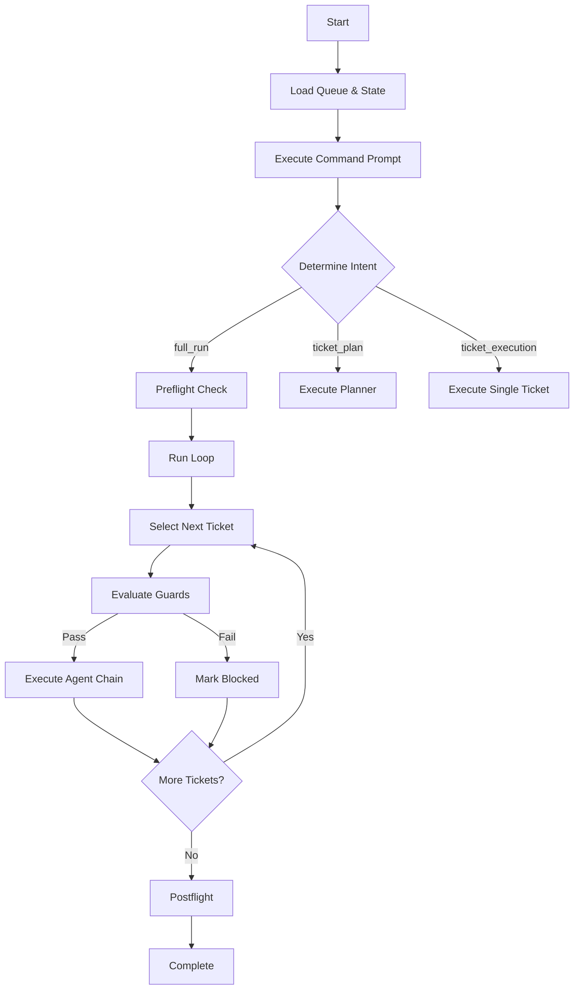

# Prompt Controller Documentation

## Overview

The prompt controller system implements a prompt-driven orchestration architecture that executes the full preflight → run → agent → postflight sequence as defined by the orchestration prompts. This replaces the previous hard-coded guard-based queue runner with a flexible, prompt-driven approach.

## Architecture

### Core Components

1. **Prompt Controller** (`lib/prompt-controller.mjs`)
   - Loads and executes prompt files
   - Manages the control loop
   - Interfaces with LLM (currently stubbed)
   - Parses structured JSON responses

2. **State Manager** (`lib/state-manager.mjs`)
   - Manages `run-state.json`
   - Tracks ticket status and phase
   - Handles queue operations
   - Generates run IDs

3. **Memory Manager** (`lib/state-manager.mjs`)
   - Manages memory storage under `automations/memory/`
   - Handles heartbeat updates
   - Writes telemetry and replay traces
   - Manages session data

4. **Guard Evaluator** (`lib/guard-evaluator.mjs`)
   - Evaluates ticket guard specifications
   - Supports multiple check types:
     - `pathExists` - Verify file/directory exists
     - `fileContainsAll` - Check file contains strings
     - `packageScripts` - Verify npm scripts exist
     - `fileMatches` - Match file content against regex
     - `jsonPath` - Validate JSON path and value

5. **Agent Executor** (`lib/agent-executor.mjs`)
   - Manages agent execution flow
   - Handles agent chaining (implementer → reviewer → qa → ops → knowledge)
   - Manages retries and failures
   - Updates state throughout execution

### Execution Flow



## Usage

### Running the Orchestrator

```bash
# Run the full orchestration
npm run automation:run:queue

# Or directly
node automations/scripts/orchestrator-run.mjs
```

### Using the Prompt Controller CLI

```bash
# Execute with full_run intent
node automations/scripts/prompt-controller.mjs --intent full_run

# Execute specific prompt
node automations/scripts/prompt-controller.mjs \
  --prompt automations/prompts/orchestrations/preflight.prompt.md \
  --context '{"run_id":"RUN-20250918-1234"}'

# Execute single ticket
node automations/scripts/prompt-controller.mjs \
  --intent ticket_execution \
  --ticket MMP-001
```

### Running Tests

```bash
# Run prompt controller tests
node automations/scripts/test-prompt-controller.mjs
```

## Prompt Structure

Each prompt must return a JSON response with the following structure:

```json
{
  "intent": "string",           // Intent classification
  "summary": "string",          // Brief summary
  "next_prompt": "path/to/next", // Next prompt to execute (null to stop)
  "follow_on": ["array"],       // Follow-on prompts
  "updates": {                  // State updates
    "run_state": {},
    "memory": [],
    "telemetry": []
  },
  "notes": "string"             // Additional notes
}
```

## LLM Integration

The system uses a pluggable LLM interface. Currently includes:

### Stubbed Interface (Testing)
```javascript
const llm = new StubbedLLMInterface({
  'pattern': 'response',
  // Map patterns to responses
});
```

### Real LLM Integration
To integrate a real LLM, implement the interface:

```javascript
class RealLLMInterface {
  async complete(prompt) {
    // Call LLM API
    // Return response string
  }
}
```

## Guard Specifications

Guards are defined in `automations/ticket-guards/<ticket_id>.json`:

```json
{
  "checks": [
    {
      "type": "pathExists",
      "path": "src/components",
      "fix": "mkdir -p src/components"
    },
    {
      "type": "fileContainsAll",
      "path": "package.json",
      "needles": ["react", "typescript"],
      "fix": "npm install react typescript"
    },
    {
      "type": "packageScripts",
      "scripts": ["build", "test"],
      "fix": "Update package.json scripts"
    }
  ],
  "summaryOnSuccess": "All prerequisites met",
  "summaryOnFailure": "Missing prerequisites"
}
```

## State Management

Run state is tracked in `automations/run-state.json`:

```json
{
  "run_id": "RUN-20250918-1234",
  "tickets": {
    "MMP-001": {
      "status": "done|blocked|in_progress",
      "phase": "implementer|reviewer|qa|ops_release|knowledge",
      "history": [...],
      "artefacts": {
        "branch": "feature/mmp-001",
        "pr": "https://github.com/...",
        "logs": [...]
      }
    }
  },
  "updatedAt": "2025-09-18T10:00:00Z"
}
```

## Memory Structure

```
automations/memory/
├── sessions/<run_id>/
│   ├── heartbeat.json    # Current status
│   └── session.json      # Session data
├── telemetry/<run_id>/
│   └── <ticket>-<phase>.json
├── replay/<run_id>/
│   └── <ticket>-<agent>.json
└── index.json           # Memory index
```

## Agent Phases

1. **Planner** - Decomposes work into tickets
2. **Implementer** - Writes code and tests
3. **Reviewer** - Reviews code changes
4. **QA** - Runs test suites
5. **Ops/Release** - Handles deployment
6. **Knowledge Steward** - Updates documentation

## Error Handling

- **Guard Failures**: Ticket marked as blocked with recommended actions
- **Agent Failures**: Retry up to 3 times, then block
- **Escalations**: Pause execution for human review
- **Max Iterations**: Control loop limited to 100 iterations

## Extension Points

### Adding New Guard Types

Add evaluator to `GuardEvaluator.initializeEvaluators()`:

```javascript
myCustomCheck: async (check) => {
  // Evaluate check
  return { ok: true/false, reason: 'string' };
}
```

### Adding New Agents

1. Create prompt file in `automations/prompts/agents/`
2. Add to agent sequence in `AgentExecutor`
3. Handle agent-specific logic in `executeAgent()`

### Custom LLM Providers

Implement the LLM interface and pass to prompt controller:

```javascript
const customLLM = new CustomLLMProvider(apiKey);
const controller = createPromptController(customLLM);
```

## Debugging

Enable debug output:
```bash
DEBUG=1 node automations/scripts/orchestrator-run.mjs
```

Check logs:
- State: `automations/run-state.json`
- Memory: `automations/memory/sessions/<run_id>/`
- Telemetry: `automations/memory/telemetry/<run_id>/`

## Migration from Old System

The new prompt-driven system replaces the hard-coded guard evaluation in the original `orchestrator-run.mjs`. Key differences:

1. **Prompt-Driven**: Decisions made by prompts, not hard-coded logic
2. **Flexible Flow**: Control flow determined by prompt responses
3. **Pluggable LLM**: Easy to integrate real LLM providers
4. **Modular Architecture**: Separated concerns into distinct modules
5. **Better Testing**: Stubbed interfaces for unit testing

## Future Improvements

1. **Real LLM Integration**: Connect to OpenAI/Anthropic APIs
2. **Parallel Execution**: Process independent tickets concurrently
3. **Advanced Memory**: Implement vector search and graph queries
4. **Monitoring Dashboard**: Real-time orchestration status
5. **Checkpoint/Resume**: Save and restore execution state
6. **Metrics Collection**: Track performance and success rates